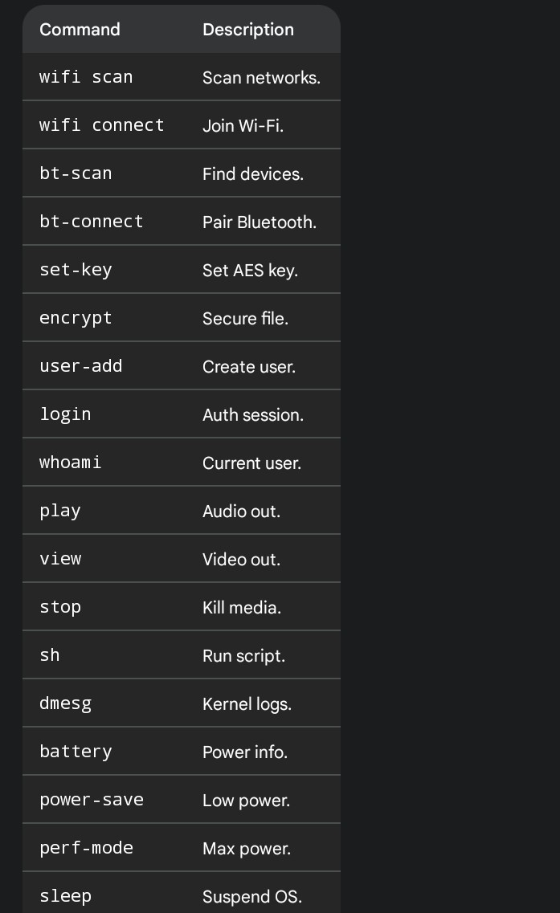
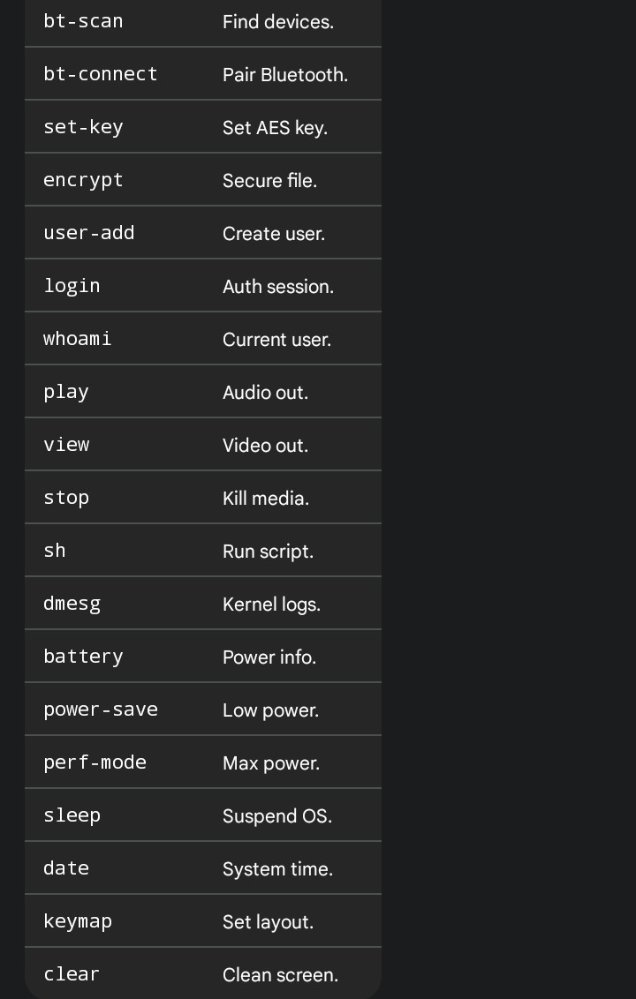
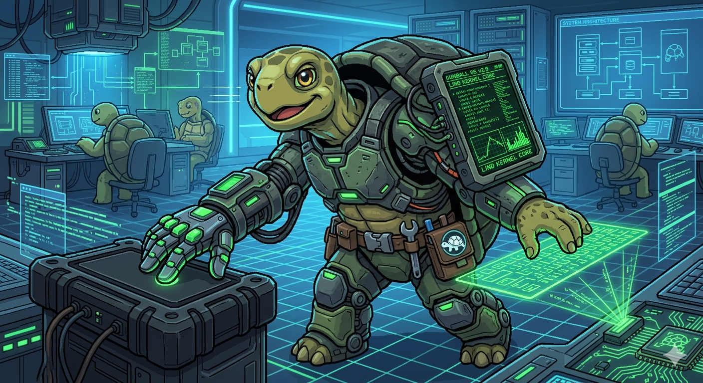

🚀 Gunball OS - The Modular Workstation Kernel
Welcome to the Gunball OS repository. This is a high-performance, modular 64-bit kernel designed for developers who want a system that adapts to their needs.
🧭 Philosophy & Vision
The core philosophy of Gunball OS is "Absolute Modularity." We believe an Operating System should be a blank canvas. Whether you want to build a secure server, a portable hacking station, or a low-level development environment, Gunball OS provides the "building blocks" to make it happen.
User-Centric Control: You decide which modules are loaded.
Hardware Empowerment: Direct communication with CPU/GPU.
Simplicity over Bloat: No unnecessary background processes.

🛠️ Evolution Path
v1.0: 125 lines (Basic Boot)
v2.0: 1,000 lines (Multitasking)
v2.9/3.0: 3,000+ lines (Secure Workstation)
Gunball OS: Be what you want to be.

---

## 🐢 Meet Lind, the Gunball OS Mascot

  

This is **Lind**. In Gunball OS, Lind represents the core values of our Kernel.

In computer engineering, a tortoise is the perfect symbol for a secure, low-level OS:

* **The Shell (Modular):** A protective layer that provides a blank canvas, allowing developers to load and unload modular building blocks (Pages/Modules) without compromising the system's core.
* **The Spirit (Secure):** A tortoise is resilient and long-lived. It protects your hardware and data from external threats, just like our integrated 256-bit AES encryption.
* **The Power (Terminal):** Lind is a digital-first creature, embodying our terminal-centric workstation design. It handles the raw data of the 64-bit Kernel without bloat.

**Gunball OS: Secure, Modular, and ready for you to be whatever you want to be.**

🛠️ Open Architecture: Modular Pages
Gunball OS is built on a Page-Based Architecture. This means that every function, driver, and command is isolated into its own dedicated "Page" of code.
Why this matters:
Separation of Concerns: Commands like wifi or encrypt are not tangled together. They live in separate files/pages.
Easy to Modify: If you want to change how a specific command works, you only need to edit its specific page without breaking the rest of the Kernel.
Add Your Own: Anyone can create a new page, write a function in C, and register a new command. The system is a blank canvas designed to be expanded by the community.
The code is yours. Feel free to fork, modify, and add your own modules to the Gunball ecosystem.
